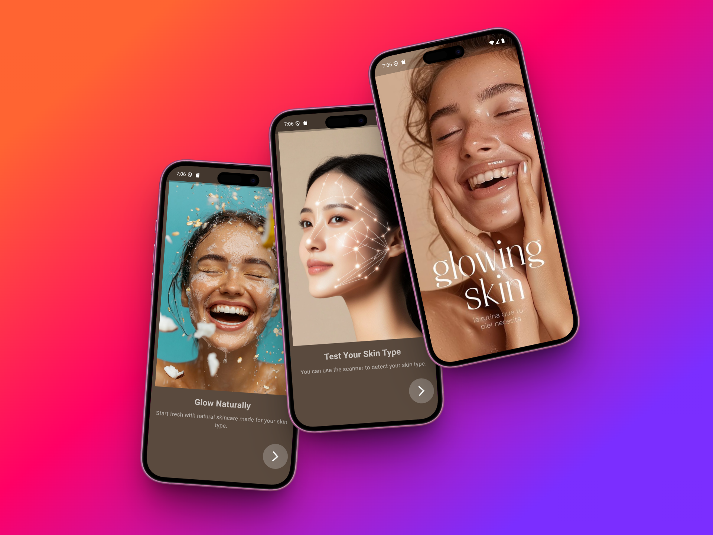
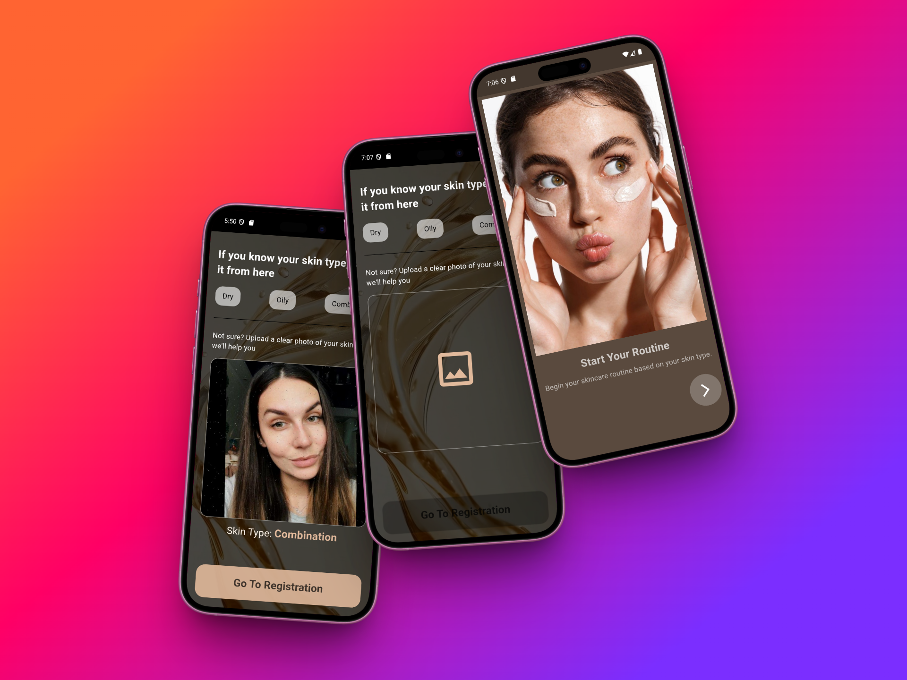
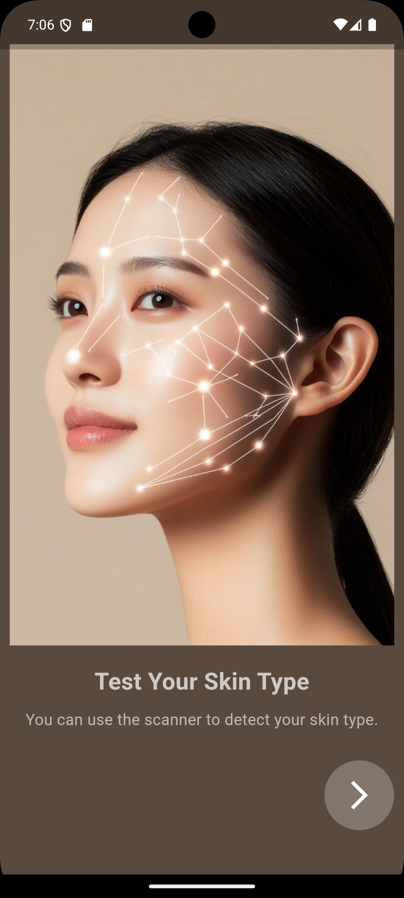
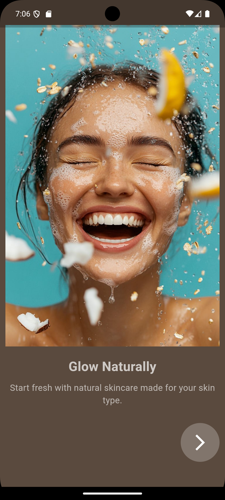
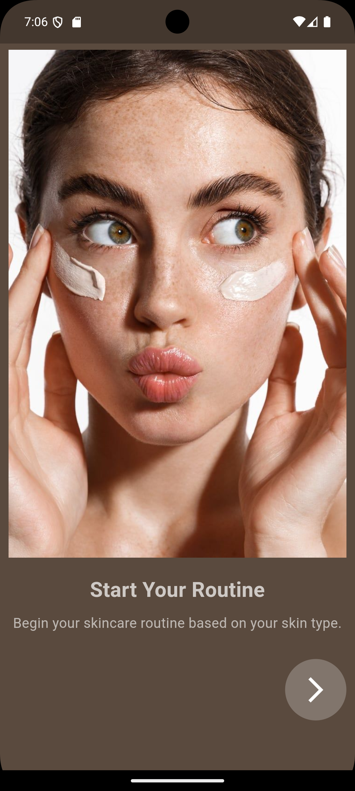
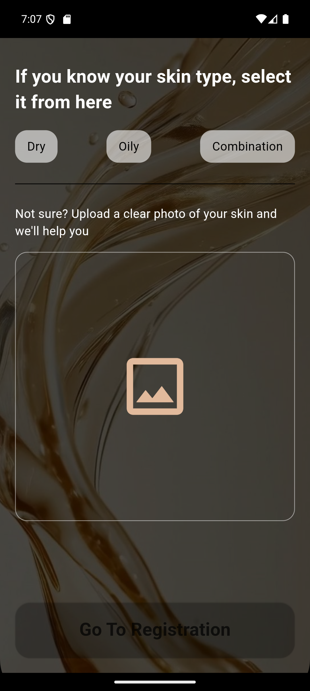
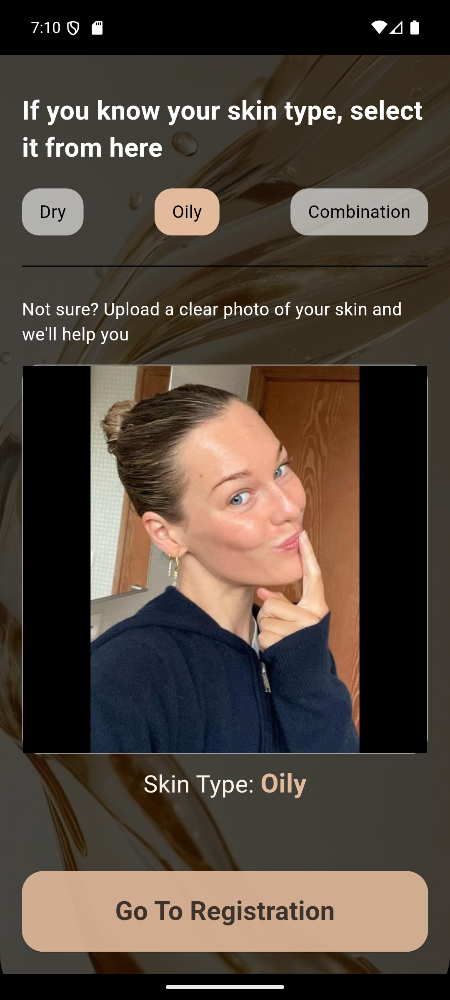
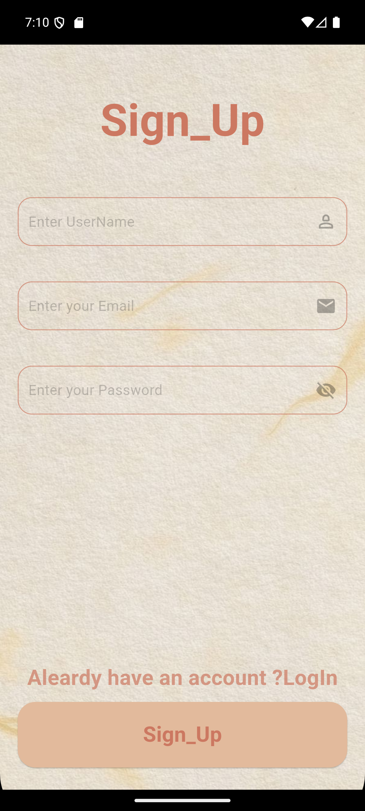

<h1>🌟 Glowvana – Skincare Routine App</h1>

Glowvana is a Flutter mobile app designed to help users build personalized skincare routines based on their skin type (dry, oily, or combination). It offers daily morning ☀️ and night 🌙 steps, recommends suitable products, tracks user progress, and allows users to view or create custom face masks. If the user is unsure about their skin type, the app uses AI-powered face scanning to analyze and detect the skin type automatically.

<h2>📸 Screenshots</h2>

<h2>🚀 Splash & Onboarding</h2>

  

    
      
  

  <!-- Auth -->
  

    
    
Auth

  

  <!-- Morning Theme Routine (2 صور) -->
  

    
    
Morning Routine 1

  

  

    
    
Morning Routine 2

  

  <!-- باقي الصور -->
  

    
    
Screen

  

  

    
    
Screen

  

  

    
    
Screen</

<h2>✨ Features</h2>
<ul>
  <li>👩‍🔬 Personalized skincare routines by skin type (Dry, Oily, Normal)</li>
  <li>🌞 Morning & 🌙 Night routines with separate themes</li>
  <li>🧴 Recommended products for each step (with why & how)</li>
  <li>🧪 Add & explore DIY masks for each skin type</li>
  <li>📈 <strong>Routine Tracker</strong>: Tracks step completion per session</li>
  <li>🖼️ Image upload & real-time card preview</li>
  <li>🗂️ Hive caching for offline access</li>
  <li>🎯 Clean MVVM architecture (Model - Repository - ViewModel - UI)</li>
</ul>

<h2>🛠️ Tech Stack</h2>
<ul>
  <li><strong>Flutter</strong> 3.x</li>
  <li><strong>Dart</strong></li>
  <li><strong>Firebase</strong> (Firestore, Auth, Storage)</li>
  <li><strong>Hive</strong> (local image caching)</li>
  <li><strong>Cubit</strong> for state management</li>
  <li><strong>MVVM</strong> pattern using clean separation of layers</li>
</ul>

<h2>📁 Project Structure</h2>
<pre>
lib/
├── core/
│   ├── utils/
│   │   ├── app_colors/
│   │   ├── styles/
│   │   ├── theme/
│   │   └── service_locator/
│   ├── models/
│   └── storage/
├── features/
│   ├── auth/
│   ├── home/
│   ├── routine/
│   │   ├── data/
│   │   │   ├── model/
│   │   │   ├── repository/
│   │   │   └── repository_impl/
│   │   └── view_model/
│   ├── masks/
│   └── shared_widgets/
└── main.dart
</pre>

<h2>🚀 Getting Started</h2>

<ol>
  <li>Clone the repo:
    <pre>git clone https://github.com/tokaahmed345/Glowvana.git</pre>
  </li>
  <li>Install dependencies:
    <pre>flutter pub get</pre>
  </li>
  <li>Configure Firebase:
    <ul>
      <li>Download <code>google-services.json</code> and add it to <code>android/app/</code></li>
      <li>Download <code>GoogleService-Info.plist</code> and add it to <code>ios/Runner/</code></li>
    </ul>
  </li>
  <li>Run the app:
    <pre>flutter run</pre>
  </li>
</ol>

<h2>🎨 Styling & Themes</h2>
<ul>
  <li><strong>Colors:</strong> <code>core/utils/app_colors/</code></li>
  <li><strong>Text Styles:</strong> <code>core/utils/styles/</code></li>
  <li><strong>Themes:</strong> Morning (light beige/salmon) & Night (dark mode)</li>
  <li><strong>Cards:</strong> Designed with subtle shadows and rounded corners</li>
</ul>

<h2>📂 Assets</h2>
<ul>
  <li>All UI assets are stored under <code>/assets</code> and declared in <code>pubspec.yaml</code></li>
  <li>Includes product images, mask illustrations, icons</li>
</ul>

<h2>📊 Routine Tracker</h2>

Users can track the completion of their skincare steps daily. Each routine step updates a tracker status locally (via Hive) and can be enhanced later for full history.

<h2>💬 Contributions</h2>

Pull requests are welcome! For ideas, feedback, or improvements – feel free to fork the repo and submit a PR.

<h2>📧 Contact</h2>

Made with ❤️ by <strong>Toka Ahmed</strong> 
<a href="https://github.com/tokaahmed345">GitHub</a> |
<a href="tokaahmed34567@gmail.com">Email</a>

